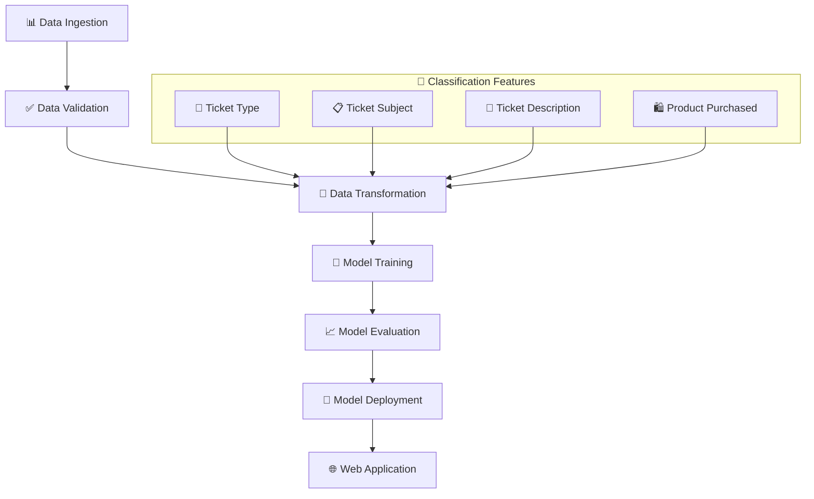

# 🎯 End-to-End Customer Satisfaction Prediction

<div align="center">
  
  [](https://python.org)
  [](https://flask.palletsprojects.com/)
  [](https://scikit-learn.org/)
  [](https://xgboost.readthedocs.io/)
  [](LICENSE)
  
  **🚀 A Production-Ready MLOps Pipeline for Intelligent Customer Support Ticket Classification**
  
  *Automatically classify customer support tickets by priority level using advanced machine learning*

</div>

---

## 📋 Table of Contents

- [🎯 Overview](#-overview)
- [✨ Key Features](#-key-features)
- [🏗️ Architecture](#️-architecture)
- [🚀 Quick Start](#-quick-start)
- [📊 Models & Performance](#-models--performance)
- [🌐 Web Interface](#-web-interface)
- [📁 Project Structure](#-project-structure)
- [🛠️ Technologies](#️-technologies)
- [📈 Future Roadmap](#-future-roadmap)
- [🤝 Contributing](#-contributing)

---

## 🎯 Overview

This **End-to-End MLOps project** revolutionizes customer support by automatically classifying support tickets into priority levels (**High**, **Medium**, **Low**) using state-of-the-art machine learning algorithms.

### 🎪 What Makes This Special?

- 🤖 **Intelligent Classification**: Analyzes ticket content, type, and product information
- 🔄 **Complete MLOps Pipeline**: From data ingestion to model deployment
- 🎨 **Beautiful Web Interface**: User-friendly Flask application
- 📊 **Model Comparison**: Automatically selects the best-performing algorithm
- 🛡️ **Production Ready**: Robust error handling and logging

---

## ✨ Key Features

<table>
<tr>
<td width="50%">

### 🏢 **Business Impact**
- ⚡ **Faster Response Times**
- 📈 **Improved Customer Satisfaction**
- 🎯 **Optimized Resource Allocation**
- 📊 **Data-Driven Decision Making**

</td>
<td width="50%">

### 🔧 **Technical Excellence**
- 🏗️ **Modular Architecture**
- ⚙️ **YAML Configuration**
- 📝 **Comprehensive Logging**
- 🧪 **Automated Testing**

</td>
</tr>
</table>

---

## 🏗️ Architecture



---

## 🚀 Quick Start

### 📋 Prerequisites
- Python 3.8+
- Git
- Virtual Environment

### ⚙️ Installation

```bash
# 📥 Clone the repository
git clone https://github.com/Durgeshsingh12712/End-to-End-Customer-Satisfaction-Prediction
cd End-to-End-Customer-Satisfaction-Prediction

# 🐍 Create virtual environment
python -m venv venv

# 🔌 Activate virtual environment
# Linux/Mac:
source venv/bin/activate
# Windows:
venv\Scripts\activate

# 📦 Install dependencies
pip install -r requirements.txt
```

### 🏃‍♂️ Running the Project

<table>
<tr>
<td width="50%">

#### 🎓 **Train the Model**
```bash
python main.py
```
*This will execute the complete ML pipeline*

</td>
<td width="50%">

#### 🌐 **Launch Web App**
```bash
python app.py
```
*Access at* `http://localhost:5000`

</td>
</tr>
</table>

---

## 📊 Models & Performance

Our system intelligently compares multiple algorithms and automatically selects the best performer:

| 🤖 Model | 🎯 Use Case | ⚡ Speed | 🎪 Interpretability |
|----------|-------------|---------|-------------------|
| **🌲 Random Forest** | Robust predictions with feature importance | ⭐⭐⭐ | ⭐⭐⭐⭐ |
| **📈 Logistic Regression** | Fast, interpretable baseline | ⭐⭐⭐⭐⭐ | ⭐⭐⭐⭐⭐ |
| **🚀 XGBoost** | High-performance gradient boosting | ⭐⭐⭐⭐ | ⭐⭐⭐ |

> 💡 **Auto-Selection**: The system automatically chooses the model with the highest test accuracy!

---

## 🌐 Web Interface

### 📱 **Beautiful & Intuitive Design**

<table>
<tr>
<td align="center" width="33%">
<h4>🏠 Home Page</h4>
<p>Clean prediction interface with form inputs</p>
</td>
<td align="center" width="33%">
<h4>🎓 Training Dashboard</h4>
<p>Monitor model training progress</p>
</td>
<td align="center" width="33%">
<h4>🔮 Prediction Results</h4>
<p>Get instant priority classifications</p>
</td>
</tr>
</table>

### 🛣️ API Endpoints

| Endpoint | Method | Description | 
|----------|--------|-------------|
| `/` | GET | 🏠 Home page with prediction form |
| `/train` | POST | 🎓 Trigger model training pipeline |
| `/predict` | POST | 🔮 Get predictions for new tickets |

---

## 📁 Project Structure

```
📦 End-to-End-Customer-Satisfaction-Prediction/
├── 📂 customerSatishfectionPrediction/
│   ├── 📂 components/           # 🧩 Core ML pipeline components
│   │   ├── 📄 data_ingestion.py
│   │   ├── 📄 data_validation.py
│   │   ├── 📄 data_transformation.py
│   │   ├── 📄 model_training.py
│   │   └── 📄 model_evaluation.py
│   ├── 📂 pipeline/             # 🔄 Pipeline orchestration
│   │    ├── 📄 training_pipeline.py
│   │    └── 📄 prediction_pipeline.py
│   ├── 📂 entity/               # ⚙️ Configuration entities
│   │    ├── 📄 config_entity.py
│   │    └── 📄 artifact_entity.py
│   ├── 📂 utils/                # 🛠️ Utility functions
│   │    └── 📄 tool.py
│   └── 📂 configure/            # 📋 Configuration management
│        └── 📄 configuration.py
├── 📂 templates/                # 🎨 Web interface templates
│    ├── 📄 index.html
│    └── 📄 results.html
├── 📂 artifacts/*               # 💾 Generated models & data
├── 📄 main.py                   # 🚀 Training pipeline entry
├── 📄 app.py                    # 🌐 Flask web application
├── 📄 requirements.txt          # 📦 Dependencies
└── 📄 README.md                 # 📚 This beautiful documentation
```

---

## 🛠️ Technologies

<div align="center">

### 🧠 **Machine Learning Stack**


### 🌐 **Web Development**


### ⚙️ **DevOps & Tools**


</div>

---

## 📈 Future Roadmap

<table>
<tr>
<td width="25%" align="center">
<h4>🐳 **Containerization**</h4>
<p>Docker support for consistent deployments</p>
</td>
<td width="25%" align="center">
<h4>🔄 **CI/CD Pipeline**</h4>
<p>Automated testing and deployment workflows</p>
</td>
<td width="25%" align="center">
<h4>📡 **Real-time Monitoring**</h4>
<p>Model performance and drift detection</p>
</td>
</tr>
</table>

### 🎯 **Upcoming Features**
- [ ] 🧪 A/B Testing Framework
- [ ] 📱 Mobile Application
- [ ] 🤖 Advanced NLP Models (BERT, GPT)
- [ ] ☁️ Cloud Deployment (AWS/GCP/Azure)
- [ ] 📊 Interactive Dashboards
- [ ] 🔔 Real-time Notifications

---

## 🤝 Contributing

We welcome contributions! Here's how you can help:

1. 🍴 **Fork** the repository
2. 🌟 **Create** a feature branch (`git checkout -b feature/AmazingFeature`)
3. 💻 **Commit** your changes (`git commit -m 'Add some AmazingFeature'`)
4. 📤 **Push** to the branch (`git push origin feature/AmazingFeature`)
5. 🔍 **Open** a Pull Request

### 📝 **Contributing Guidelines**
- Follow PEP 8 coding standards
- Add comprehensive tests
- Update documentation
- Use descriptive commit messages

---

<div align="center">

## 🎉 **Ready to Transform Your Customer Support?**

### [⚡ Get Started Now](#-quick-start) | [📊 View Demo](https://github.com/Durgeshsingh12712/End-to-End-Customer-Satisfaction-Prediction) | [💬 Join Discussion](https://github.com/Durgeshsingh12712/End-to-End-Customer-Satisfaction-Prediction/discussions)

---

**Made with ❤️ by [Durgesh Singh](https://github.com/Durgeshsingh12712)**

⭐ **Star this repo if it helped you!** ⭐

</div>